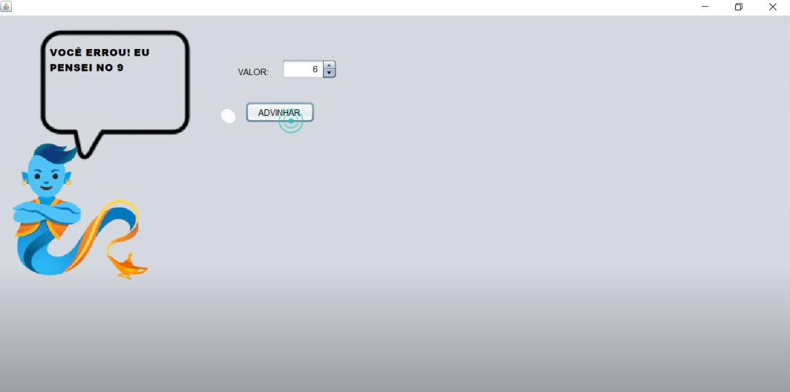

# JOGO DO GENIO
👨‍🏫PROJETO CRIADO PARA O CURSO DE JAVA DO CURSO EM VIDEO.

  
  

## DESCRIÇÃO:
- O aplicativo "Jogo do Gênio" é uma pequena aplicação gráfica desenvolvida em Java utilizando Swing. Ele simula um jogo simples onde o usuário tenta adivinhar um número aleatório escolhido pelo programa entre 1 e 10.

- Este aplicativo exemplifica o uso básico de componentes gráficos Swing para criar uma pequena aplicação interativa em Java, onde o usuário pode interagir através da interface gráfica para tentar adivinhar um número escolhido aleatoriamente pelo programa.

## FUNCIONALIDADES:
1. **Interface Gráfica (GUI)**:
   - A interface gráfica é construída utilizando componentes Swing do Java, como `JFrame`, `JLabel`, `JSpinner`, e `JButton`.
   - Imagens são utilizadas para decorar a interface, como as imagens do gênio e da mensagem.

2. **Inicialização e Mensagem Inicial**:
   - Quando o programa é iniciado (`main` method), uma instância da classe `JanelaGenio` é criada e tornada visível.
   - A mensagem inicial é exibida no `JLabel lblFrase` indicando que o gênio está pensando em um número entre 1 e 10.

3. **Adivinhação do Número**:
   - O usuário seleciona um número utilizando o `JSpinner txtVal` e clica no botão "ADVINHAR" (`btnPalpite`).
   - Um número aleatório é gerado pelo programa (`n = 1 + Math.random() * (11-1)`).
   - O valor selecionado pelo usuário (`num`) é comparado com o número aleatório gerado (`valor`).
   - Se o número selecionado pelo usuário corresponder ao número aleatório, a mensagem "ACERTOU!" é exibida.
   - Caso contrário, a mensagem informa qual era o número que o gênio tinha em mente.

4. **Manipulação de Texto HTML em JLabel**:
   - Para formatar e exibir mensagens multi-linha, o texto na `JLabel lblFrase` é configurado usando HTML (`<html>` e `</html>`).
   - Isso permite exibir mensagens formatadas com quebras de linha e estilização de texto.

5. **Encerramento da Aplicação**:
   - A aplicação pode ser encerrada clicando no botão de fechar da janela ou fechando a janela pelo sistema operacional.

## ABRINDO O PROJETO NO NETBEANS IDE:
   1. **Inicie o NetBeans:**
      Abra o NetBeans IDE a partir do menu Iniciar (Windows) ou do lançador de aplicativos (macOS).

   2. **Navegue até o Projeto:**
      No menu superior, clique em "Arquivo" (ou "File" em inglês) e escolha "Abrir Projeto" (ou "Open Project").

   3. **Selecione o Diretório do Projeto:**
      Navegue até o diretório `CODIGO`, onde está localizado o projeto e selecione a pasta principal. Esta pasta contém o arquivo `pom.xml`.

   4. **Abra o Projeto:**
      Selecione a pasta do projeto e clique em "Abrir" (ou "Open" em inglês).

   5. **Aguarde a Abertura:**
      O NetBeans irá carregar o projeto. Isso pode levar alguns momentos, dependendo do tamanho do projeto e da velocidade do seu computador.

   6. **Projeto Aberto:**
      Uma vez que o projeto é carregado com sucesso, ele aparecerá no painel "Projetos" no canto esquerdo do IDE, e você poderá executa-lo clicando em `Run`.

## TECNOLOGIAS USADAS:
- [LINGUAGEM JAVA:](https://github.com/VILHALVA/CURSO-DE-JAVA) A linguagem de programação Java é amplamente utilizada para o desenvolvimento de aplicativos devido à sua portabilidade, segurança e robustez. Ela é uma escolha popular para desenvolver aplicativos desktop, web e móveis.

- [JAVA SWING:](https://github.com/VILHALVA/CURSO-DE-JAVA-SWING) Java Swing é um conjunto de bibliotecas gráficas para a criação de interfaces de usuário (UI) em Java. Ele fornece componentes gráficos avançados, como botões, caixas de texto, tabelas e muito mais, permitindo que os desenvolvedores criem aplicativos desktop com uma interface de usuário rica e interativa.

- [NETBEANS IDE](https://netbeans.apache.org/download/index.html) O NetBeans IDE é um ambiente de desenvolvimento integrado gratuito e de código aberto para o desenvolvimento de aplicativos Java, bem como para várias outras linguagens de programação, como PHP, C/C++, e HTML5. Ele oferece uma série de recursos poderosos, como edição de código avançada, depuração, controle de versão e integração com servidores de aplicativos, facilitando o desenvolvimento de software em Java e outras plataformas.

## CREDITOS:
- [PROJETO CRIADO PARA O CURSO DE JAVA](https://github.com/VILHALVA/CURSO-DE-JAVA)
- [PROJETO FEITO PELO VILHALVA](https://github.com/VILHALVA)

